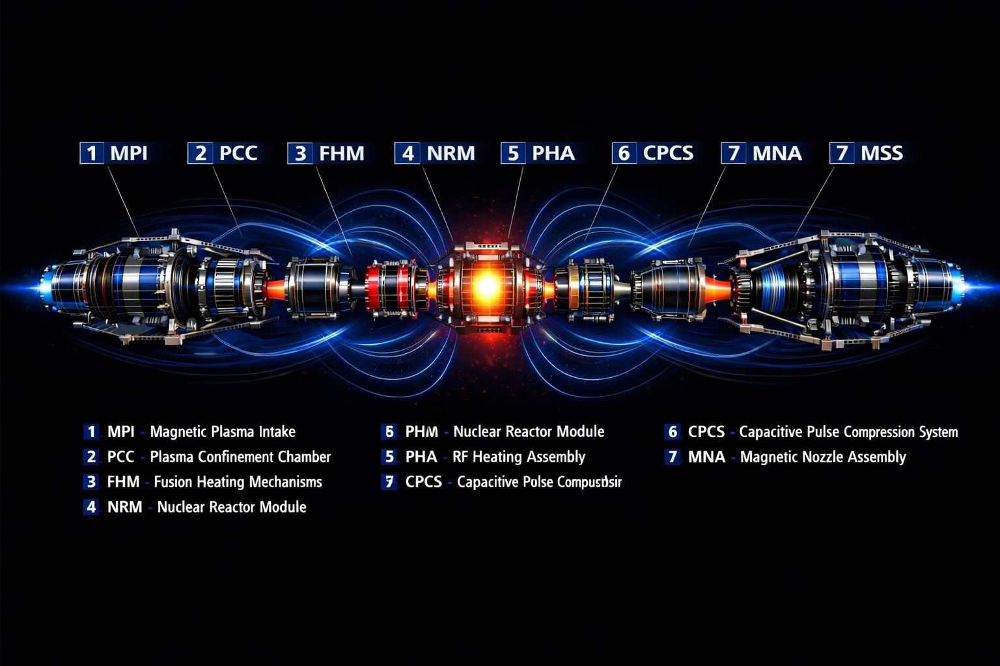
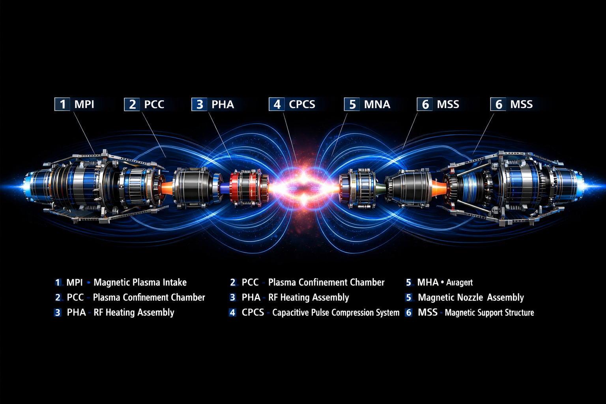

<!-- ========================= -->
<!--   MCPD – TWITTER CARD     -->
<!-- ========================= -->
<meta name="twitter:card" content="summary_large_image">
<meta name="twitter:title" content="MCPD – Magnetically Captured Plasma Drive">
<meta name="twitter:description" content="Progetto di propulsione nucleare-plasmatica ideato da Salvatore Esposito Faraone.">
<meta name="twitter:image" content="https://esfasal561.github.io/MCPD/assets/img/mcpd-cover.png">

<!-- ========================= -->
<!--   MCPD – BANNER ANIMATO   -->
<!-- ========================= -->

  <!-- MSS -->
  

  <!-- PCC + MNA -->
  

  <!-- PHA -->
  

  <!-- CPCS -->
  

  <!-- PCC -->
  

  

    <h1 style="color:#e6e6e6; font-family:Consolas, monospace; font-size:30px; margin:0;">
      MCPD – Magnetically Captured Plasma Drive
    </h1>
    

      MPI · PCC · PHA · CPCS · MNA · MSS — Hybrid Nuclear–Plasma Propulsion Concept
    

  

---

# MCPD – Magnetically Captured Plasma Drive
### Hybrid Nuclear–Plasma Propulsion Concept

---

Il **Magnetically Captured Plasma Drive (MCPD)** è un concetto di propulsione nucleare–plasma sviluppato da **Salvatore Esposito Faraone**, basato sulla cattura, stabilizzazione, riscaldamento e compressione del plasma tramite sistemi magnetici avanzati.

---

  

---

  

---

  

---

  

---

# 🚀 Navigazione MCPD

### 🔷 Moduli del Sistema Propulsivo
- [Overview del Sistema](PROJECT_OVERVIEW.md)
- [Magnetic Plasma Intake (MPI)](MPI_module.md)
- [Plasma Confinement Chamber (PCC)](pcc_Magnetic-confinement.md)
- [RF Heating Assembly (PHA)](PHA_RF-Heathing.md)
- [Capacitive Pulse Compression System (CPCS)](CPCS_pulse-compression.md)
- [Magnetic Nozzle Assembly (MNA)](MNA_magnetic-nozzle.md)
- [Magnetic Support System (MSS)](MSS_module.md)
- [Nuclear Reactor Module (NRM)](NRM.html)

---

  <h3 style="margin-top:0;">Nuclear Reactor Module (NRM)</h3>
  

    Il <strong>Nuclear Reactor Module (NRM)</strong> è la sorgente energetica primaria del MCPD.
    Alimenta tutti i moduli magnetici, il PHA (CRT + ECRH/ICRH) e il CPCS, rendendo possibile
    il funzionamento dell’intera pipeline propulsiva.
  

  

    <a href="NRM.html" style="color:#7fd1ff;">
      ➜ Apri la pagina dedicata al Nuclear Reactor Module
    </a>
  

---

# 📘 Documentazione Principale
- [Project Overview](PROJECT_OVERVIEW.md)
- [White Paper v2.0](WHITEPAPER_MCPD_v2.md)
- [Scientific Abstract](SCIENTIFIC_ABSTRACT_MCPD.md)
- [Executive Summary](EXECUTIVE_SUMMARY.md)

---

# 🧩 Architettura del Sistema
- [System Architecture Diagram](MCPD_ARCHITECTURE_DIAGRAM.md)
- [Propulsion & Energy Modules Index](INDEX_PROPULSION_MODULES.md)
- [Plasma Dynamics & Exhaust Nozzle](PLASMA_DYNAMICS_EXHAUST_NOZZLE.md)
- [Nuclear Reactor Module (NRM)](NRM.html)

---

# 🔬 Fondamenti Scientifici
- [Nuclear–Plasma Hybrid Model](NUCLEAR_PLASMA_MODEL.md)
- [Magnetic Field Topology](MAGNETIC_FIELD_TOPOLOGY.md)
- [Fusion Heating Methods](FUSION_HEATING.md)

---

# 🧭 Roadmap & Sviluppo
- [Roadmap MCPD](ROADMAP_MCPD.md)
- [Milestones Tecniche](MILESTONES.md)
- [Future Research Directions](FUTURE_RESEARCH.md)

---

## English Documentation
- [MCPD vs Nuclear Fusion Propulsion](MCPD_vs_Fusion_EN.md)
- [Comparative Diagram](MCPD_Comparative_Diagram_EN.md)

---

  
  © 2026 — Progetto MCPD · Salvatore Esposito Faraone

